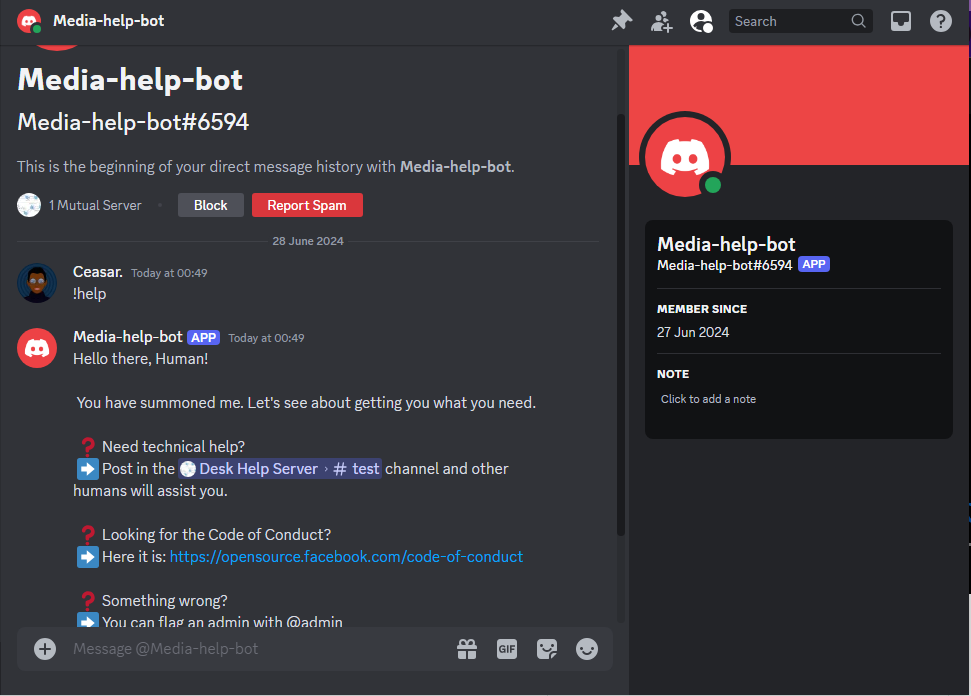

# Discord Help Bot Built With Rust And Serenity




<!-- TABLE OF CONTENTS -->
## Table of Contents

- [Discord Help Bot](#discord-help-bot)
  - [Table of Contents](#table-of-contents)
  - [About the Project](#about-the-project)
  - [Demo](#demo)
    - [Built With](#built-with)
  - [Getting Started](#getting-started)
    - [Manual Setup](#manual-setup)
      - [Prerequisites](#prerequisites)
      - [Installation](#installation)
    - [VSCode Dev Container Setup](#vscode-dev-container-setup)
      - [Prerequisites](#prerequisites-1)
      - [Spinning Up The Environment](#spinning-up-the-environment)
    - [Running](#running)
  - [Contributing](#contributing)
  - [License](#license)
  - [Contact](#contact)
  - [Acknowledgements](#acknowledgements)

<!-- ABOUT THE PROJECT -->
## About the Project

 This project is for me to do project for my portfolio and also in my bid to solve real world problems.

## Demo

![discord-help-bot demo][./discord.png]

This is what `discord_help_bot` looks like in action.

### Built With

* [Rust](https://www.rust-lang.org/)
* [serenity](https://github.com/serenity-rs/serenity)

<!-- GETTING STARTED -->
## Getting Started

To get a local copy up and running follow the simple steps under either of the following sections:
- [Manual Setup](#manual-setup) – follow this if you prefer to install all dependencies locally.
- [VSCode Dev Container Setup](#vscode-dev-container-setup) – follow this to run the project in an isolated development environment inside a Docker container, pre-installed with all dependencies.

### Manual Setup

#### Prerequisites

Make sure you have Rust installed.

```shell
curl --proto '=https' --tlsv1.2 -sSf https://sh.rustup.rs | sh
```

#### Installation

1. Clone the discord_help_bot
```sh
git clone https://github.com/Chidubemkingsley/discord_help_bot.git
```
2. Build the project
```sh
cargo build
```
3. Follow the instructions in the [Running](#running) section.

### VSCode Dev Container Setup

#### Prerequisites

This requires VSCode, Docker and the Remote Development extension pack. For more details see [the official docs](https://code.visualstudio.com/docs/remote/containers#_system-requirements).

#### Spinning Up The Environment

- Follow [the official guide](https://code.visualstudio.com/docs/remote/containers#_quick-start-open-a-git-repository-or-github-pr-in-an-isolated-container-volume) to open this repository inside a dev container. VSCode will read the [config file](.devcontainer/devcontainer.json) provided to auto-install relevant dependencies and extensions.
- To run terminal commands, use the [integrated terminal](https://code.visualstudio.com/docs/editor/integrated-terminal) functionality.

### Running

Make sure to replace <use your token here> with your Discord auth token.

1. Run the project
```sh
DISCORD_TOKEN=<use your token here> ./target/debug/discord_help_bot
```

<!-- CONTRIBUTING -->
## Contributing

Contributions are what make the open source community such an amazing place to be learn, inspire, and create. Any contributions you make are **greatly appreciated**. See [`CONTRIBUTING`](CONTRIBUTING.md) for more information.

<!-- LICENSE -->
## License

Distributed under the Apache 2.0 License. See [`LICENSE`](LICENSE) for more information.

<!-- CONTACT -->
## Contact

 -Reach Me On:

 -Rubeluchukwuisi Chidubem Kingsley - [@KingsleyCaesar1](https://x.com/KingsleyCaesar1)

<!-- ACKNOWLEDGEMENTS -->
## Acknowledgements

* [The Rust Community](https://www.rust-lang.org/community)
* [serenity](https://github.com/serenity-rs/serenity)
* [@othneildrew](https://github.com/othneildrew) - for the [README template](https://github.com/othneildrew/Best-README-Template)

